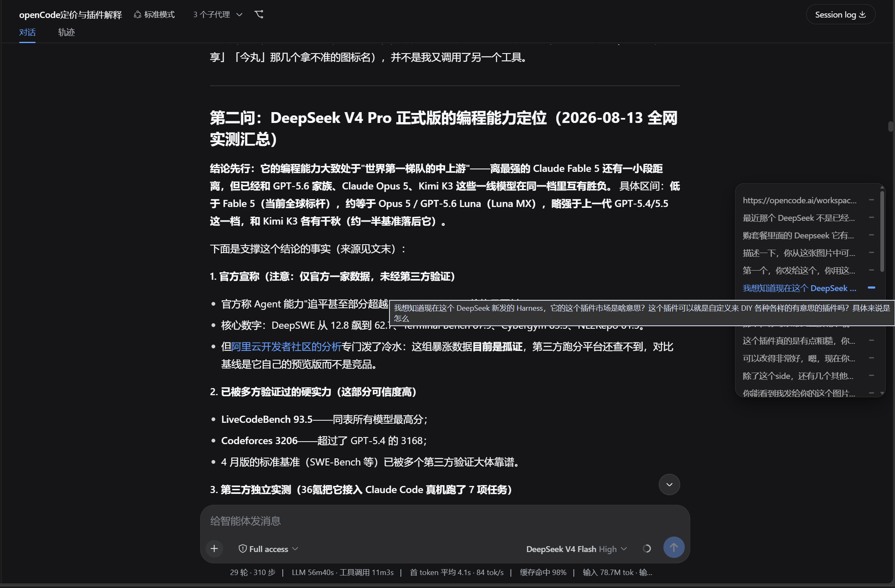
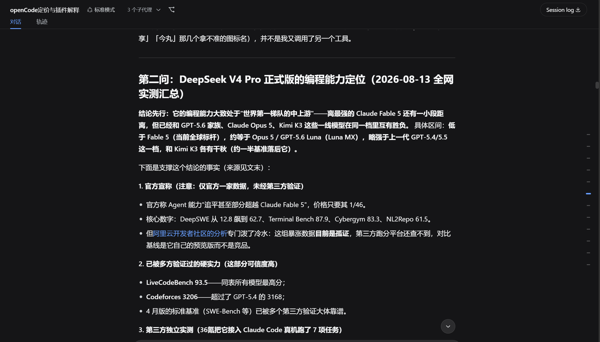

# dsh-chat-timeline

[**English**](README.en.md) | 简体中文

[](LICENSE)
[](https://github.com/dwb-ajay/dsh-chat-timeline)
[](https://github.com/dwb-ajay/dsh-chat-timeline/pulls)

> Fork of [jjxjjjjiik-bot/dsh-chat-timeline](https://github.com/jjxjjjjiik-bot/dsh-chat-timeline) with **dsh-rewind** compatibility.
>
> ⭐️ **如果这个小插件帮到了你，请给本项目点一个免费的 [Star](https://github.com/dwb-ajay/dsh-chat-timeline) 支持一下！**

**1:1 复刻 DeepSeek 官网右侧「对话导航栏」**的 DeepSeek Harness (DSH) 插件——把 `chat.deepseek.com` 官方网页版的 ScrollNav 界面与交互原样带进你的 DSH Web 聊天界面。

> 非 DeepSeek 官方出品，与 DeepSeek 无任何关联。

## 预览

<div align="center">
  
  
</div>

## 功能

- **常驻右侧导航轨**——屏幕右侧细长竖轨，每条用户消息对应一个指示线，与官网折叠态一致
- **全模式主题适配**——1:1 像素级复刻 DeepSeek 官网浅色/深色主题，浅色模式下灰线清爽优雅、白底毛玻璃展开面板；深色模式沉浸暗黑
- **悬停展开**——面板显示消息预览，随滚动实时高亮当前阅读位置（品牌蓝）
- **点击跳转**——一键平滑滚动到对应消息，自动加载更早历史
- **动态避让**——智能检测右侧工作台（如 aionui 等工具栏），自动平移贴合聊天区边缘，避免重叠遮挡
- **自动隐藏**——会话少于 2 条用户消息时自动隐藏
- **移动端适配**——视口宽度 ≤ 767px 时自动隐藏，避免在手机上遮挡对话内容；旋转/拉伸窗口后自动恢复
- **无障碍**——ARIA 标签 + 遵循系统「减弱动态效果」设置
- **兼容 dsh-rewind**——对话回退后，侧栏同步隐藏被撤回的用户消息（不再残留“幽灵”条目）

## 工作原理

Host 侧通过会话投影（`dshChatTimeline`）持久化枚举所有用户消息；客户端 `TimelineRail` 组件渲染导航轨（挂载于 `conversation.input.dock` 插槽，portal 到 body），数据源按速度优先：投影 → 已加载节点 → 后台 `loadOlder`。

本 fork（`dwb-ajay/dsh-chat-timeline`）在上游基础上修复了与 `dsh-rewind-plugin` 的不同步：surface replace / rewind 隐藏范围会从时间线索引与侧栏渲染中剔除。

## 安装

### 方式一：从本 fork 安装（推荐）

```bash
dsh plugin --profile web add github:dwb-ajay/dsh-chat-timeline
```

若你本地已装上游 `dsh-chat-timeline`，先移除再装本 fork，避免重复轨：

```bash
dsh plugin --profile web remove dsh-chat-timeline
dsh plugin --profile web add github:dwb-ajay/dsh-chat-timeline
```

安装完成后，重启 `dsh web` 并刷新浏览器即可。

---

### 方式二：Windows 本地一键脚本（克隆/下载仓库）

1. 下载本项目（绿色 Code 按钮 → Download ZIP 解压，或 `git clone`）
2. 双击 **`install.bat`** —— 脚本自动完成：复制插件 → 注册配置 → `pnpm install`
3. 重启 `dsh web` 并刷新浏览器

> 脚本可重复运行，不会重复安装。

---

### 方式三：手动安装（其他平台或本地开发）

1. 将插件复制到 `$DSH_HOME/profiles/web/plugins/dsh-chat-timeline/`（`$DSH_HOME` 通常是 `~/.dsh`）
2. 在 `profiles/web/package.json` 添加依赖 `"dsh-chat-timeline": "file:plugins/dsh-chat-timeline"`，运行 `pnpm install`
3. 在 `profiles/web/cordis.patch.yml` 添加：
   ```yaml
   - insert:
       - id: chat-timeline
         name: dsh-chat-timeline
   ```
4. 重启 `dsh web` 并刷新浏览器

## 架构参考

- 布局/CSS：官网 ScrollNav 的 1:1 移植（提取自官方 `main.css`，以 `dsct_` 前缀命名空间化）
- 插件架构：参考 [asukasec/dsh-message-preview](https://github.com/asukasec/dsh-message-preview)（MIT）

## License

MIT — 见 [LICENSE](LICENSE)。"DeepSeek" 商标归其所有者所有，本项目与 DeepSeek 无关联。
